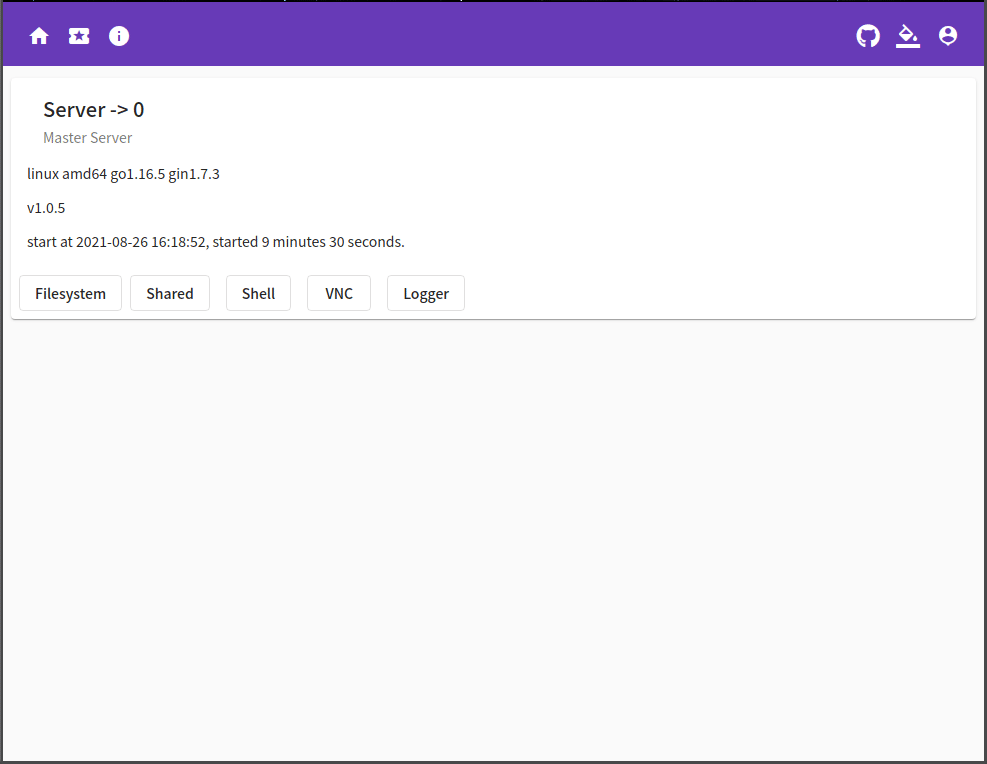
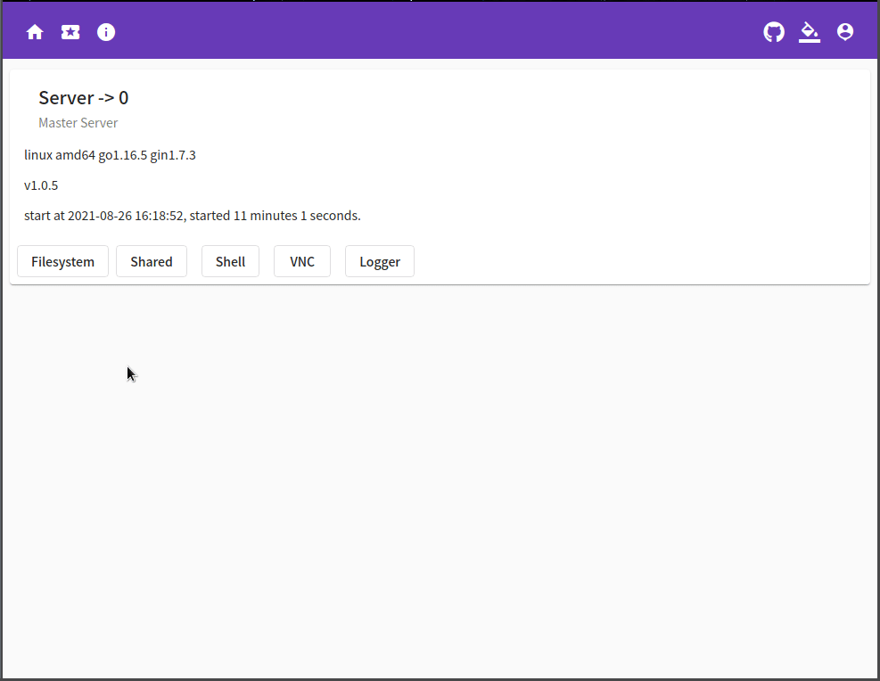
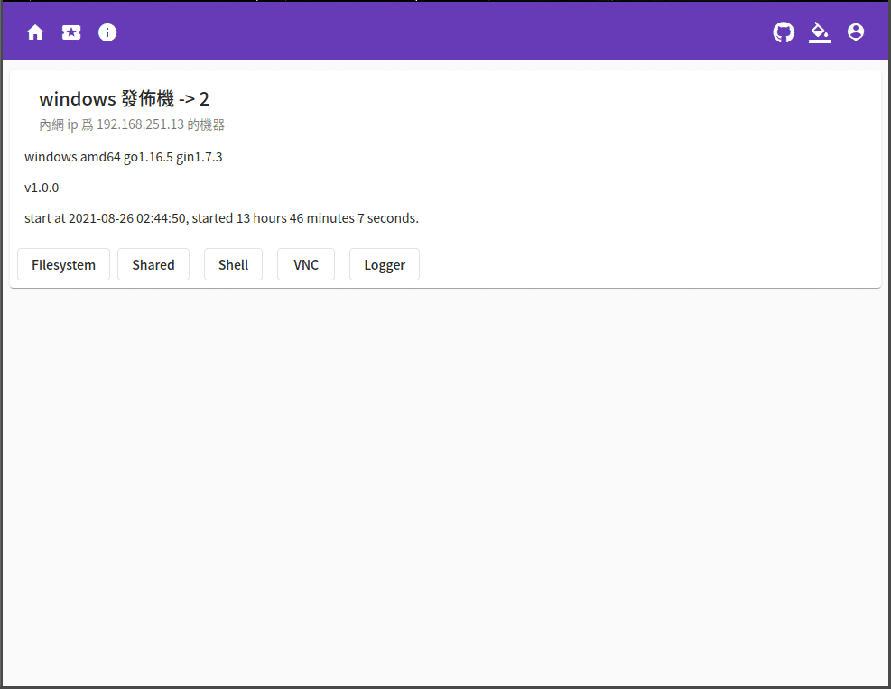

# webpc
Manage multiple remote computers via http5

English [中文](README.zh-Hant.md)

Paid software such as TeamViewer helps you control multiple computers remotely. WebPC completes similar functions and is completely free and open source. At the same time, WebPC makes full use of modern browsers and only needs to use the browser to remotely control your computer without installing additional control programs.

WebPC mainly has the following characteristics:

* No client software required for all operations through the browser
* All controlled terminals provide file operations imitating the local system on the browser
* Execute commands on the controlled end through a remote shell, such as running vim
* In the browser, noVNC usually realizes the remote desktop function to the controlled end
* The controlled end can configure the functions provided by itself to prevent WebPC from being used as a Trojan horse program
* Create port forwarding or socks5 proxy to the controlled end to facilitate access to the internal network of the controlled end
* Simple user and grouping system to control user access rights and scope
* Support multiple system platforms(linux windows mac ...)
* Support to retrieve the latest released program from github and automatically upgrade

## Table of Contents

- [Background](#Background)
- [How](#How)
- [Install](#Install)
    - [docker](docker/README.md)
    - [linux-amd64](#linux-amd64)
    - [windows-amd64](#windows-amd64)
- [Set-up](#Set-up)
    - [Set-up-master](#Set-up-master)
    - [Set-up-slave](#Set-up-slave)
- [Build](#Build)
    - [Build-View](#Build-View)
    - [Build-WebPC](#Build-WebPC)
- [Groups-Permissions](#Groups-Permissions)





## Background

The popularity of computer equipment and the rapid development of the network make remote operation of computers more and more necessary and common. ssh and rdp can only control a device with an independent external network ip, and each has its own advantages and disadvantages. Services that provide remote management and control of multiple devices such as TeamViewer are usually not suitable for non-commercial users. And usually only provides remote desktop but remote shell for Linux and other devices is usually more useful and efficient. In addition, it is annoying to install an annoying remote control program. So I sorted out the above needs, and realized all customer functions to the browser is this project WebPC.

## How

1. First, a server is required to receive user requests and the registration of the controlled end. We call this server the master, and all controlled ends are slaves.

2. The slave will register itself with the master and maintain a virtual network channel to the master. Salve provides grpc services to the master on this virtual network channel to support various remote control functions.

3. When the master receives a user request, it finds the registered slave and forwards the request to the slave.

## Install

For linux-amd64 and windows-amd64, pre-compiled programs have been provided, please download and install directly. For other platforms, you need to compile by yourself, and refer to the following for installation.

### linux-amd64

#### master

1. Download the latest program and unzip it to /opt/webpc/webpc

2. Copy /opt/webpc/webpc-master.service to /etc/systemd/system/webpc-master.service to install the master service for systemd

    ```
    sudo cp /opt/webpc/webpc-master.service /etc/systemd/system/webpc-master.service
    ```

    If you modify the installation directory, remember to modify the corresponding path in webpc-master.service

3. Create webpc user

    ```
    sudo useradd webpc -Mrs /sbin/nologin
    ```

4. Run the service

    ```
    sudo systemctl start webpc-master.service
    ```

The random username and password created by the system can be obtained from **./var/logs/master/webpc.log** after the first run:

```
$ cat ./var/logs/master/webpc.log 
...
{"level":"info","ts":1630285898.3816726,"msg":"init user","user":"king","password":"08ab28ebb369dc15cc2c95dc972348ee"}
...
```

#### slave

1. Download the latest program and unzip it to /opt/webpc/webpc

2. Copy /opt/webpc/webpc-slave.service to /etc/systemd/system/webpc-slave.service to install the slave service for systemd

    ```
    sudo cp /opt/webpc/webpc-slave.service /etc/systemd/system/webpc-slave.service
    ```

    If you modify the installation directory, remember to modify the corresponding path in webpc-slave.service

3. Create webpc user

    ```
    sudo useradd webpc -Mrs /sbin/nologin
    ```

4. Run the service

    ```
    sudo systemctl start webpc-slave.service
    ```

### windows-amd64

#### master

1. Download the latest program and unzip
2. Run controller.bat as an administrator and enter the command **1** to install the master service
3. Run webpc-master-service service in windows service manager

The random username and password created by the system can be obtained from **./var/logs/master/webpc.log** after the first run:

```
$ cat ./var/logs/master/webpc.log 
...
{"level":"info","ts":1630285898.3816726,"msg":"init user","user":"king","password":"08ab28ebb369dc15cc2c95dc972348ee"}
...
```

#### slave

1. Download the latest program and unzip
2. Run controller.bat as an administrator and enter the command **2** to install the slave service
3. Run webpc-slave-service service in windows service manager

## Set-up

* WebPC uses jsonnet as the configuration file
* **etc/master.jsonnet** is the master's main setting, and it imports the sub-settings under the **etc/master** folder
* **etc/slave.jsonnet** is the slave's main setting, and it imports the sub-settings under the **etc/slave** folder

### Set-up-master

http.libsonnet defines how master provides website services

```
local def = import "def.libsonnet";
local size = def.Size;
local duration = def.Duration;
{
    // http addr
    Addr: ':9000',
    // if not empty use https
    CertFile: '',
    KeyFile: '',
    // enable swagger-ui on /document/
    Swagger: true,
    // grpc server option
    Option: {
        WriteBufferSize: 32*size.KB,
        ReadBufferSize: 32*size.KB,
        InitialWindowSize: 0*size.KB, // < 64k ignored
        InitialConnWindowSize: 0*size.KB, // < 64k ignored
        MaxRecvMsgSize: 0, // <1 6mb
        MaxSendMsgSize: 0, // <1 math.MaxInt32
        MaxConcurrentStreams: 0,
        ConnectionTimeout: 120 * duration.Second,
        Keepalive: {
            MaxConnectionIdle: 0,
            MaxConnectionAge: 0,
            MaxConnectionAgeGrace: 0,
            Time: 0,
            Timeout: 0,
        },
    },
}
```

system.libsonnet defines the master itself as a slave to register to itself to provide remote control, and only users with Root or Server permissions can control the master

### Set-up-slave

connect.libsonnet sets up where the controlled terminal can register itself. You need to add a remote control device to the web service first, and copy the registered address and fill in the URL attribute of this file

```
local def = import "def.libsonnet";
local size = def.Size;
local duration = def.Duration;
{
    // http addr
    URL: 'ws://127.0.0.1:9000/api/v1/dialer/64048031f73a11eba3890242ac120064',
    // if true allow insecure server connections when using SSL
    // Insecure: true, 
    // grpc server option
    Option: {
        WriteBufferSize: 32*size.KB,
        ReadBufferSize: 32*size.KB,
        InitialWindowSize: 0*size.KB, // < 64k ignored
        InitialConnWindowSize: 0*size.KB, // < 64k ignored
        MaxRecvMsgSize: 0, // <1 6mb
        MaxSendMsgSize: 0, // <1 math.MaxInt32
        MaxConcurrentStreams: 0,
        ConnectionTimeout: 120 * duration.Second,
        Keepalive: {
            MaxConnectionIdle: 0,
            MaxConnectionAge: 0,
            MaxConnectionAgeGrace: 0,
            Time: 0,
            Timeout: 0,
        },
    },
}
```

system.libsonnet sets what functions the slave will provide

```
{
    //Shell : "shell-linux", // if empty, linux default value shell-linux.sh
    //Shell : "shell-windows.bat", // if empty, windows default value shell-windows.bat
    // vnc server address
    VNC: "127.0.0.1:5900",
    // mount path to web
    Mount: [
        {
            // web display name
            Name: "s_movie",
            // local filesystem path
            Root: "/home/dev/movie",
            // Set the directory to be readable. Users with read/write permissions can read files
            Read: true,
            // Set the directory to be writable. Users with write permission can write files
            // If Write is true, Read will be forcibly set to true
            Write: true,
            // Set as a shared directory to allow anyone to read the file
            // If Shared is true, Read will be forcibly set to true
            Shared: true,
        },
        {
            Name: "s_home",
            Root: "/home/dev",
            Write: true,
            Read: true,
            Shared: false,
        },
        {
            Name: "s_root",
            Root: "/",
            Write: false,
            Read: true,
            Shared: false,
        },
        {
            Name: "s_media",
            Root: "/media/dev/",
            Write: false,
            Read: true,
            Shared: false,
        },
    ],
}
```

## Build

WebPC back-end uses golang and grpc development, front-end uses angular development, and needs to be compiled separately. 

### Build-View

1. Install the necessary development environment node typescript yarn

2. Download the project and switch the working directory to webpc/view

    ```
    git clone git@github.com:powerpuffpenguin/webpc.git && cd webpc/view
    ```
3. Install project dependencies

    ```
    yarn install
    ```

    or

    ```
    npm install
    ```

4. Compile the front-end code

    ```
    ../build.sh view
    ```

### Build-WebPC

1. Install the necessary development environment gcc golang proto3 grpc protoc-gen-go protoc-gen-grpc-gateway protoc-gen-openapiv2 

2. Install golang code embedding tool

    ```
    go install github.com/rakyll/statik
    ```

3. Download the project and switch the working directory to webpc

    ```
    git clone git@github.com:powerpuffpenguin/webpc.git && cd webpc
    ```

4. Generate grpc code

    ```
    ./build.sh grpc
    ```

5. Embed front-end code and static files into golang code

    ```
    ./build.sh document
    ./build.sh view -s
    ```

6. Compile go code

    ```
    go build -o bin/webpc
    ```

# Groups-Permissions

All users and controlled terminals in the WebPC exist under the node of a tree group. When the user's group is the ancestor node of the group where the controlled terminal belongs, the user can control the controlled terminal.

The permissions determine the operations that the user can perform include the following definitions:

* Root -> Can perform any operation
* Server -> When the master is registered as a slave, only users with Server permissions can control it
* Shell -> Ability to obtain remote shell execution commands
* Read -> Can read the web file system set by the fs module
* Write -> You can upload files or modify files through the fs module
* VNC -> Remote desktop operation can be done through vnc
* Slave -> You can add, delete, modify the slave list