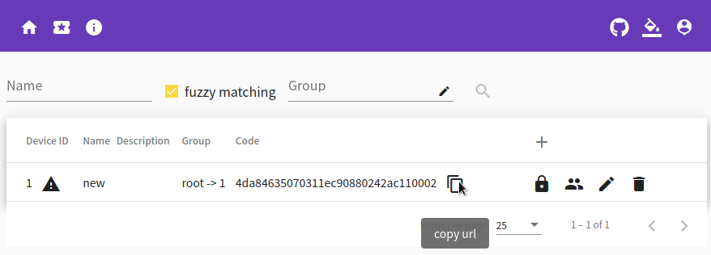

# webpc

Manage multiple remote computers via http5

More info at [https://github.com/powerpuffpenguin/webpc](https://github.com/powerpuffpenguin/webpc)


# Run master

Starting a master instance is simple:

```
docker run \
    --name webpc-master \
    -p :8000:8000 \
    -d king011/webpc:v1.0.8
```

View the random username and password created in the first run from the log:
```
$ docker logs webpc-master 
2021-08-27T06:44:39.439Z	INFO	logger set fileroot	{"fileroot": "/opt/webpc/var/logs/master/", "name": "webpc", "ext": ".log"}
2021-08-27T06:44:39.439Z	INFO	db group	{"driver": "sqlite3", "source": ["/opt/webpc/var/webpc_master.db"]}
2021-08-27T06:44:39.439Z	INFO	db default cacher	{"record": 1000}
2021-08-27T06:44:39.439Z	INFO	db set cacher	{"name": "data_of_user", "record": 100}
2021-08-27T06:44:39.439Z	INFO	db set cacher	{"name": "data_of_slave", "record": 100}
2021-08-27T06:44:39.497Z	INFO	session bolt provider	{"filename": "/opt/webpc/var/sessionid.db", "access": "1h0m0s", "refresh": "36h0m0s", "max size": 10000, "check batch": 128, "clear": "30m0s"}
2021-08-27T06:44:39.574Z	INFO	session local manager	{"method": "HMD5", "key": "cerberus is an idea", "coder": "GOB"}
2021-08-27T06:44:39.574Z	INFO	mount	{"name": "fs", "root": "/opt/webpc/fs", "read": true, "write": true, "shared": false}
2021-08-27T06:44:39.574Z	INFO	mount	{"name": "root", "root": "/", "read": true, "write": false, "shared": false}
2021-08-27T06:44:39.574Z	INFO	listen success	{"addr": ":8000", "h2": false}
user = king
password = 4f445e07b64410668c86951b92f25d60
2021-08-27T06:44:39.733Z	INFO	init user	{"user": "king", "password": "4f445e07b64410668c86951b92f25d60"}
2021-08-27T06:44:40.092Z	INFO	shell	{"shell": "/opt/webpc/shell-linux"}
2021-08-27T06:44:40.092Z	INFO	VNC	{"connect": "127.0.0.1:5900"}
```

Use a browser to serve your system http://your_ip:your_port


# Run slave

Starting a slave instance is simple:

```
docker run \
    --name webpc-slave \
    -e RUN_SLAVE=1 \
    -e CONNECT_URL=your_registered_address \
    -d king011/webpc:v1.0.8
```

Create a new slave on the homepage of the website and copy **your_registered_address** from it



# Overwrite your own settings

master:

```
docker run \
    --name webpc-master \
    -p :8000:8000 \
    -v your_configure_dir:/opt/webpc/etc \
    -d king011/webpc:v1.0.8
```

slave:

```
docker run \
    --name webpc-slave \
    -e RUN_SLAVE=1 \
    -e CONNECT_URL=your_registered_address \
    -v your_configure_dir:/opt/webpc/etc \
    -d king011/webpc:v1.0.8
```